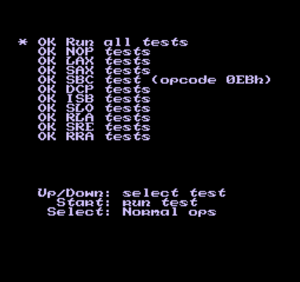

# Weaknes

Weaknes is a NES emulator written by JavaScript.

  

## Usage

### Build
```console
$ npm install
$ npm run build
```
### Usage of NES emulator
#### index.js
```javascript
async function main() {
  const path = './assets/nestest/nestest.nes'
  const Nes = NesPack.Nes
  const Screen = NesPack.Screen
  const Rom = NesPack.Rom

  nes = new Nes()

  /* A screen's argument is Canvas tag's id */
  const screen = new Screen.Browser('canvas')
  nes.connect(screen)

  const data = await fetch(path)
  .then(response => response.arrayBuffer())
  .then(buffer => new Uint8Array(buffer))

  const rom = new Rom(data)
  nes.rom = rom

  nes.run()
}

main()
```
### index.html
```html
<!DOCTYPE html>
<html>
  <head>
    <meta charset="utf-8">
    <link rel="icon" href="data:;base64,iVBORwOKGO=" />
    <title>Screen of NES emulator</title>
  </head>
  <body>
    <canvas id="canvas" width="256" height="240"></canvas>
    <script src="dist/bundle.js"></script>
    <script src="index.js"></script>
  </body>
</html>
```

### Usage of Tool
#### index.js
```javascript
const Rom = NesPack.Rom

const data = await fetch(path)
.then(response => response.arrayBuffer())
.then(buffer => new Uint8Array(buffer))

const rom = new Rom(data)
nes.rom = rom

const Tool = NesPack.Tool
const palette = [0x31, 0x3d, 0x2d, 0x1f]
const tool = new Tool('chr-dump', palette)
tool.rom = rom

tool.dumpChrRom()

```

#### index.html

```html
<!DOCTYPE html>
<html>
  <head>
    <meta charset="utf-8">
    <link rel="icon" href="data:;base64,iVBORwOKGO=" />
    <title>Renderer of NES emulator</title>
  </head>
  <body>
    <canvas id="chr-dump" width="300" height="240"></canvas>
    <script src="dist/bundle.js"></script>
    <script src="index.js"></script>
  </body>
</html>
```

### Run server
```console
$ npm run serve
```
After run server, open http://localhost:1234
